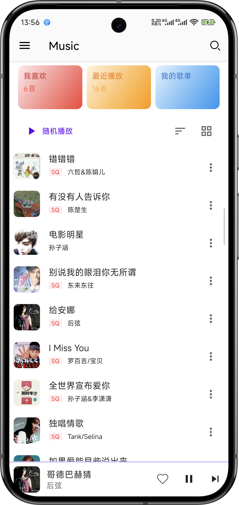
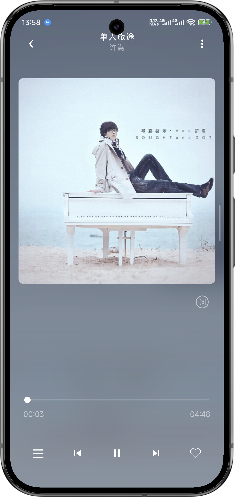
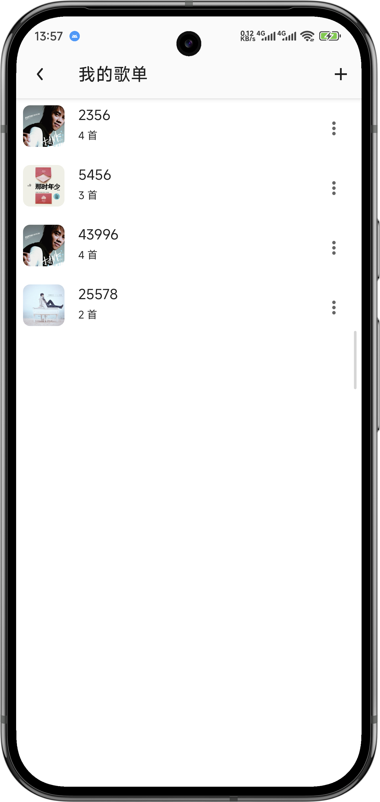
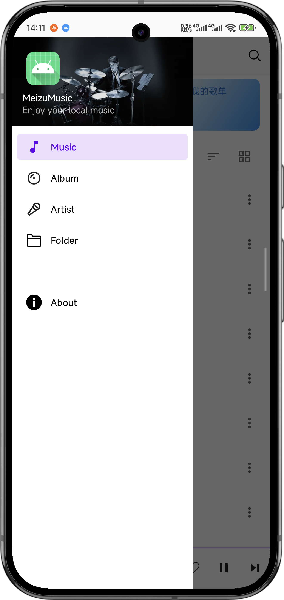

# Meizu Music (仿魅族音乐播放器)

一个基于 `Clean Architecture` + `MVVM` 架构，使用现代 Android 技术栈 (Kotlin, Coroutines, Flow, Hilt, Media3, Room) 构建的本地音乐播放器项目。

## ✨ 项目特色 (Features)

- **现代化的 UI 设计**: 仿魅族音乐风格，支持浅色/深色模式动态切换，并通过高斯模糊、Palette API 取色等技术实现沉浸式播放界面。
- **核心播放功能**:
    - 基于 `Media3 (ExoPlayer)` 和 `MediaSessionService` 实现稳定可靠的后台播放、通知栏控制和音频焦点管理。
    - 支持播放队列管理（列表播放、点击播放）。
    - 支持播放模式切换（列表循环、随机播放、单曲循环）。
- **完善的媒体库管理**:
    - 通过 `ContentResolver` 高效扫描本地 `MediaStore` 音频文件。
    - 支持多种媒体库浏览维度：歌曲、专辑、歌手、文件夹。
    - 使用 `Paging 3` 实现音乐主列表的流畅分页加载。
- **丰富的交互体验**:
    - 支持列表/网格视图动态切换。
    - 支持多种排序方式（默认、按名称 A-Z）。
    - 独立、功能完善的实时搜索页面。
- **用户个性化功能**:
    - **我喜欢**: 标记和收藏喜爱的歌曲。
    - **最近播放**: 自动记录播放历史和统计数据。
    - **歌单系统**: 支持创建歌单、添加/移除歌曲、重命名/删除歌单。
- **健壮的架构设计**:
    - 采用 Clean Architecture 和 MVVM 模式，实现高度的模块化和关注点分离。
    - 通过应用级单例的 `SharedPlayerViewModel` 实现跨页面的播放状态统一管理。
    - 使用 `BottomSheetDialogFragment` 封装可复用的菜单逻辑，代码整洁、高内聚。

## 📸 应用截图 (Screenshots)

| 主页 | 播放页 | 歌单列表 | 抽屉导航 |
| :---: | :---: | :---: | :---: |
|  |  |  |  |

## 🛠️ 技术栈 & 架构 (Tech Stack & Architecture)

- **核心语言**: [Kotlin](https://kotlinlang.org/)
- **架构模式**: Clean Architecture, MVVM (Model-View-ViewModel)
- **异步处理**: [Coroutines](https://kotlinlang.org/docs/coroutines-overview.html) + [Flow](https://developer.android.com/kotlin/flow)
- **依赖注入**: [Hilt](https://developer.android.com/training/dependency-injection/hilt-android)
- **UI**:
    - Android Jetpack (Lifecycle, ViewModel, Navigation Component)
    - Material Design 3
    - ViewBinding
- **数据**:
    - [Room](https://developer.android.com/training/data-storage/room): 用于持久化用户数据（歌单、喜欢、播放历史）。
    - [Paging 3](https://developer.android.com/topic/libraries/architecture/paging/v3-overview): 用于主列表的响应式分页加载。
    - `ContentResolver`: 用于查询 `MediaStore`。
- **媒体播放**: [Media3 (ExoPlayer & MediaSession)](https://developer.android.com/jetpack/androidx/releases/media3)
- **第三方库**:
    - [Coil](https://coil-kt.github.io/coil/): 图片加载。
    - [material-dialogs](https://github.com/afollestad/material-dialogs): 构建美观、易用的对话框。
    - [Blurry](https://github.com/wasabeef/Blurry): 用于实现高斯模糊效果。
    - [Palette API](https://developer.android.com/training/material-design/extract-colors-with-palette): 用于从图片中提取主题色。
    - [LrcView](https://github.com/pengrad/LrcView): 用于显示和同步歌词。
    - [Timber](https://github.com/JakeWharton/timber): 日志库。

## 🚀 如何构建 (Setup)

1.  克隆此仓库:
    ```bash
    git clone https://github.com/HsiYang506/MeizuMusic.git
    ```
2.  使用最新稳定版的 Android Studio 打开项目。
3.  等待 Gradle 同步完成并构建项目。
4.  连接设备或启动模拟器，运行应用。

**注意**: 应用需要获取“读取音频文件”的权限才能正常工作。